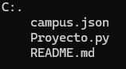

# PROYECTO PYTHON

Se realizó el código para la realización del proyecto trabajado en grupo.

# Descripción

Este repositorio cuenta con tres archivos los cuales son: [Proyecto.py] y [campus.json] que contienen el código y la información utilizados para la realización del proyecto y [README.md] utilizado para la explicación del proyecto.

# Tecnologías utilizadas

- PYTHON
- JSON

# Estructura del proyecto

Como se puede observar la estructura contiene tres archivos donde se encuentra el código, información utilizada en el código y un archivo readme.md con la explicación de ambos archivos.

# Características:

| Nombre | Descripción |
|--|--|
|Archivo [.py]| Contiene el código utilizado para la realización del proyecto.|
|Archivo [.json]| Contiene la información utilizada en el código.

# Desarrollado por

El trabajo fue desarrollado por Alejandra Machuca y Yessica Perez, estudiantes de CampusLands como proyecto de Python.