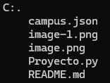

# PROYECTO PYTHON

Se llevo a cabo el código para la realización del proyecto trabajado en grupo.

# Descripción

Este repositorio cuenta con tres archivos los cuales son: 
* [Proyecto.py]:Contiene el código principal.
* [campus.json]:Información utilizada para la realización del proyecto.
* [README.md]:Utilizado para la explicación del proyecto.

# Tecnologías utilizadas

| Python | Json
|--|--|
||

# Estructura del proyecto

Como se puede observar la estructura contiene tres archivos donde se encuentra el código, información utilizada en el código y un archivo readme.md con la explicación de ambos archivos.

# Características:

| Nombre | Descripción |
|--|--|
|Archivo [.py]| Contiene el código utilizado para la realización del proyecto.|
|Archivo [.json]| Contiene la información utilizada en el código.

## Instrucciones
1. Clonar el repositorio cargado el GitHub.
2. Abrir en la nube el archivo Python.

# Desarrollado por

El trabajo fue desarrollado por Alejandra Machuca Molina y Yessica Andrea Perez Machuca, estudiantes de CampusLands como proyecto de filtro de Python y Git.